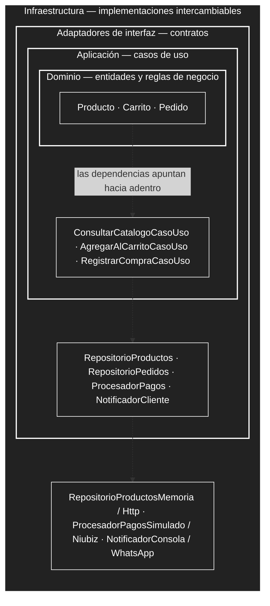

# Enfoque arquitectónico: Clean Architecture

Las dependencias internas mediante Clean Architecture.

| Elemento | Descripción aplicada al Marketplace |
|---|---|
| Patrón / enfoque arquitectónico | Clean Architecture (Arquitectura Limpia). |
| Objetivo | Separar responsabilidades y controlar las dependencias hacia el dominio. |
| ¿Qué problema resuelve? | Evita el acoplamiento entre la interfaz Angular, las reglas del negocio y las tecnologías externas, como bases de datos, API y servicios de pago. |
| Capas definidas | Presentación, Aplicación, Dominio e Infraestructura. |
| Beneficios | Facilita el mantenimiento y las pruebas unitarias. Permite cambiar implementaciones técnicas sin modificar innecesariamente las reglas del negocio. Mejora la organización y separación de responsabilidades del código. |

## Diagrama

## Comprobación

El proyecto incluye pruebas del dominio que corren con `npm run pruebas`, sin Angular ni navegador. Que
esas pruebas compilen y pasen es la prueba de que el dominio y los casos de uso no dependen del
framework, cumpliendo la regla de dependencias de Clean Architecture.