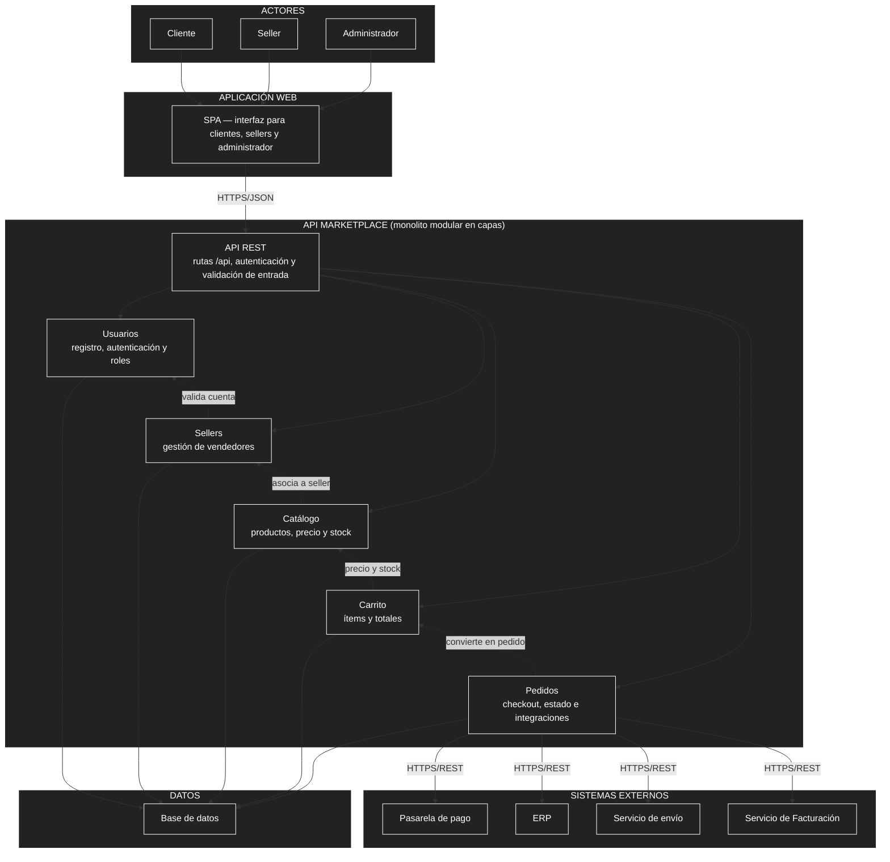

# Componentes arquitectónicos

## Diagrama de componentes

## Descripción

El contenedor **API Marketplace** (monolito modular en capas) expone una **API REST** que distribuye las peticiones hacia sus módulos internos: **Usuarios**, **Sellers**, **Catálogo**, **Carrito** y **Pedidos**. Cada módulo lee y escribe sus propias tablas en la **base de datos**. El módulo **Pedidos** es el único que se integra con los sistemas externos: **pasarela de pago**, **ERP**, **servicio de envío** y **servicio de Facturación**.