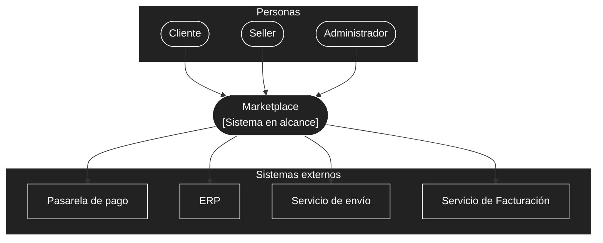

# Nivel 1 · Diagrama de contexto del sistema

> **Proyecto:** Marketplace · **Modelo:** C4 · Nivel 1 de 4

## 1. Objetivo

Mostrar el Marketplace como una sola caja: quiénes lo usan y con qué sistemas externos se comunica.

| Aspecto | Descripción |
|---|---|
| Pregunta que responde | ¿Qué es el sistema, quién lo usa y con quién se integra? |
| Audiencia | Todos: docente, equipo, cualquier persona sin conocimiento técnico |
| Qué no muestra | Tecnologías, servidores, bases de datos ni módulos internos |
| Siguiente nivel | `Nivel2-DiagramadeContenedores.md` |

## 2. Diagrama

## 3. Personas

| Persona | Qué hace en el sistema |
|---|---|
| Cliente | Busca productos, consulta información, agrega al carrito, realiza pedidos, paga y consulta sus pedidos. |
| Seller | Ofrece y registra productos, los actualiza y gestiona su información de ventas. |
| Administrador | Administra la plataforma. |

## 4. Sistemas

| Sistema | Tipo | Responsabilidad |
|---|---|---|
| Marketplace | Sistema en alcance | Conecta clientes y sellers: catálogo, carrito, pedidos y pago. |
| Pasarela de pago | Sistema externo | Procesa los pagos (RC04). |
| ERP | Sistema externo | Proporciona información de productos y stock. |
| Servicio de envío | Sistema externo | Gestiona la información de entrega (RC05). |
| Servicio de Facturación | Sistema externo | Genera los comprobantes de pago. |

## 5. Decisiones y supuestos

| # | Decisión o supuesto | Origen |
|---|---|---|
| 1 | El sistema es una aplicación web (no app móvil nativa). | RC01 |
| 2 | La comunicación frontend-backend es vía API REST. | RC03 |
| 3 | El pago se delega siempre a una pasarela externa; el Marketplace no procesa tarjetas directamente. | RC04 |

### Pendiente por definir

| Tema | Detalle |
|---|---|
| Sentido de la integración con el ERP | Confirmar si el ERP también envía información al Marketplace o solo la recibe. |