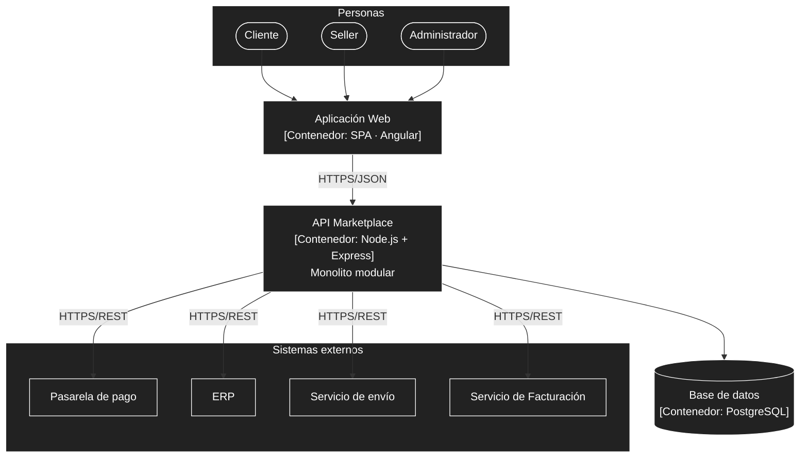

# Nivel 2 · Diagrama de contenedores

> **Proyecto:** Marketplace · **Modelo:** C4 · Nivel 2 de 4

## 1. Objetivo

Abrir la caja "Marketplace" del nivel 1 y mostrar las aplicaciones y almacenes de datos que la componen.

| Aspecto | Descripción |
|---|---|
| Pregunta que responde | ¿De qué piezas ejecutables se compone el sistema y con qué tecnología? |
| Nivel anterior | `Nivel1-DiagramadeContextodelSistema.md` |
| Siguiente nivel | `Nivel3-Diagrama-de-Componentes.md` |

> **Nota:** `restricciones.md` solo exige "API REST" (RC03), sin fijar lenguaje ni base de datos. La tecnología concreta de este nivel (Node.js + Express, PostgreSQL) es una **decisión propuesta**, no algo ya implementado.

## 2. Diagrama

## 3. Contenedores

| Contenedor | Tecnología | Responsabilidad |
|---|---|---|
| Aplicación Web | SPA · Angular | Interfaz para clientes, sellers y administrador. El código de referencia de Clean Architecture está en `tecnologia/boilerplate-clean-arquitecture/`. |
| API Marketplace | Node.js + Express (propuesta) | Expone la API REST, aplica las reglas de negocio e integra los sistemas externos. Monolito modular. |
| Base de datos | PostgreSQL (propuesta) | Almacena usuarios, sellers, productos, carritos y pedidos. |

## 4. Decisiones arquitectónicas reflejadas

| Decisión | Driver relacionado | Motivo |
|---|---|---|
| Un único contenedor de backend (monolito modular) | DA06 | Permite separar módulos en servicios a futuro sin rediseñar todo. |
| Frontend separado del backend (SPA + API REST) | RC03 | Se despliegan y evolucionan de forma independiente. |
| PostgreSQL como base de datos | — (propuesta) | Pedidos y pagos necesitan transacciones consistentes. |
| Solo la API se comunica con los sistemas externos | DA03, DA04 | Las credenciales de los proveedores quedan en el servidor, no en el navegador. |

## 5. Seguridad entre contenedores

| Comunicación | Medida |
|---|---|
| Navegador → Aplicación web y API | HTTPS |
| Aplicación web → API | Token de sesión en cada petición (DA03) |
| API → Sistemas externos | Credenciales de cada proveedor solo en el servidor |